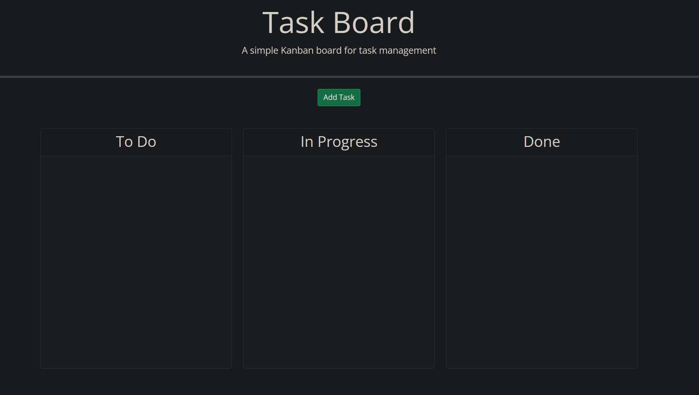

# project-pal
## Description
A simple task board application that allows a team/user to manage project tasks. By having a calendar system provided by Days.js the tasks can be properly monitored throughout its progress and importance.

## Purpose
This project was a challenge to myself to explore JavaScript libraries and to get a delve into modals and Bootstrap CSS. It also serves as practice for my JavaScript syntax and local storage capabilities.

## Installation
You can access the application through the deployed URL: 
https://kushonim.github.io/project-pal/ 

## Screenshot

## Author
GitHub - @Kushonim

## License
MIT License
